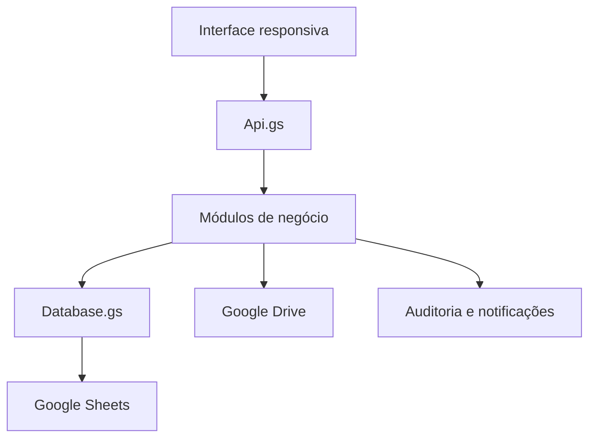

# Arquitetura

O CozinhaFlow é um aplicativo web serverless. O Google Apps Script entrega a interface, executa as regras, autentica os usuários do sistema e persiste os registros em uma planilha Google.

## Camadas

| Camada | Arquivos | Responsabilidade |
|---|---|---|
| Entrada | `Code.gs`, `index.html` | Web app, includes, instalação e rotinas |
| API e segurança | `Api.gs`, `Auth.gs`, `Usuarios.gs` | Sessão, autorização e despacho das ações |
| Negócio | `Tarefas.gs`, `Producoes.gs`, `Estoque.gs` e demais módulos | Validação e regras operacionais |
| Persistência | `Database.gs`, `Config.gs` | Cabeçalhos, consultas e escrita em Sheets |
| Interface | `*.html`, `*-js.html`, `styles.html` | Telas, componentes e eventos do navegador |
| Evidências | `Media.gs` | Upload e leitura controlada de imagens no Drive |
| Observabilidade | `Auditoria.gs`, `Notifications.gs`, `Health.gs` | Histórico, alertas e diagnóstico |

## Convenções

- Funções internas terminam com `_`.
- Campos persistidos usam nomes em maiúsculas iguais aos cabeçalhos.
- Exclusões comuns são lógicas por meio do campo `STATUS`.
- Toda ação chamada pelo navegador passa pelo roteador autenticado da API.
- O código não depende de build: `clasp push` envia diretamente `.gs`, `.html` e `appsscript.json`.

## Quadro de tarefas

No desktop, as três listas aparecem lado a lado. No celular, um seletor mostra uma lista por vez para conservar largura e manter os botões acessíveis. A troca de estado é feita por ações explícitas: iniciar, concluir, cancelar ou reabrir.

Não há catálogo fixo de tarefas. `TITULO` e `DESCRICAO` são textos livres gravados em cada registro.
