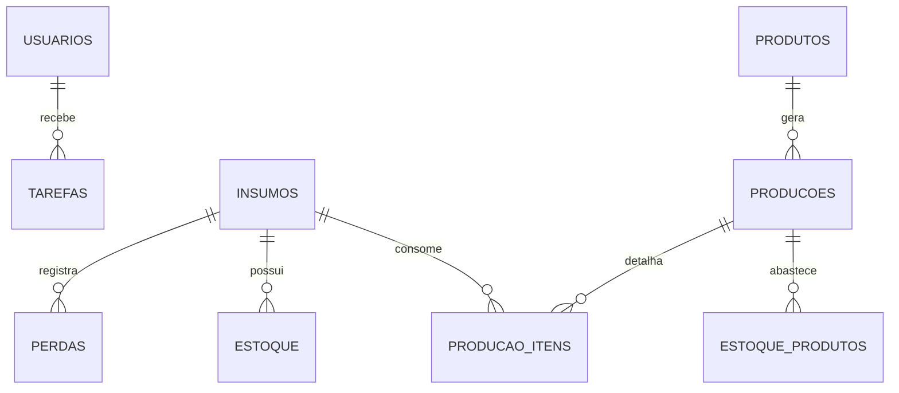

# Modelo de dados

`Config.gs` é a fonte oficial dos cabeçalhos. `setupSystem()` cria todas as abas e `repairInstallation()` acrescenta a estrutura esperada em instalações existentes sem apagar linhas.

## Relações principais

## Grupos de abas

| Domínio | Abas |
|---|---|
| Acesso e equipe | `USUARIOS`, `OPERADORES` |
| Trabalho | `TAREFAS`, `NOTIFICACOES` |
| Cadastros | `INSUMOS`, `PRODUTOS`, `RECEITAS`, `RECEITAS_ITENS`, `FORNECEDORES` |
| Estoque | `ESTOQUE`, `ESTOQUE_PRODUTOS`, `MOVIMENTACOES` |
| Produção | `PRODUCOES`, `PRODUCAO_ITENS`, `PERDAS` |
| Suprimentos | `COMPRAS`, `PEDIDOS`, `PEDIDOS_ITENS` |
| Controle | `INVENTARIOS`, `AJUSTES`, `FECHAMENTOS`, `AUDITORIA`, `CONFIG`, `CONFIGURACOES` |

## Custos

Cada entrada de estoque pode informar `CUSTO_UNITARIO`. O custo médio do insumo considera o valor dos lotes com saldo. Ao consumir um lote, produção e perda carregam seu custo real.

- Custo da perda: `quantidade perdida × custo unitário consumido`.
- Custo total da produção: soma do custo dos insumos efetivamente consumidos.
- Custo por unidade produzida: `custo total ÷ quantidade produzida`.
- Custo médio do produto em estoque: valor dos lotes produzidos com saldo dividido pela quantidade existente.

## Rendimento de produção

O produto informa peso unitário e unidade de peso. Na finalização:

- peso embalado em kg = quantidade produzida × peso unitário convertido;
- pacotes por kg = quantidade produzida ÷ kg de insumo;
- aproveitamento = kg embalados ÷ kg de insumo × 100.

Exemplo: 10 kg de queijo que geram 50 pacotes de 180 g resultam em 9 kg embalados, 5 pacotes/kg e 90% de aproveitamento.
